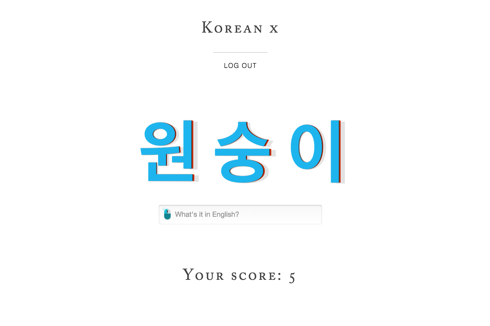

- [GitHub](https://github.com/robbykim/korean-x)
- [Live Demo](https://young-anchorage-88242.herokuapp.com)

## Overview

The product will provide a spaced repetition algorithm that aid in learning Korean in a very effective manner.

Disclaimer: This project is mainly built for learning purposes and not intended for production use.

## Scenarios

Robby's parents immigrated from Korea but he was born and raised in New York. Because of this, Robby sucks at Korean. Sean however is awesome at Korean. Robby has tried to learn Korean but it never seems to stick. Robby finds Sean's new product, 'Learn from Sean', and after working with it, finds that the information is sticking a lot better.

## Non-Goals

This version will not support the following features:

- Multiple language support
- Sharing between Accounts

## Functionality

### Frontend

The frontend for the app will be built using React and Redux, and allow users to login, answer the questions, and see how many questions they have successfully answered. To answer a question the user will be shown a word in the language they are trying to learn on the left-hand side of the screen, and asked to type the corresponding word in their native language on the right-hand side. When they submit the they will be given feedback on whether they were correct, and taken to the next question.

The frontend will need to submit information stating whether the question was answer correctly or not to the backend so that the spaced repetition algorithm can take that into account. This will also allow the user's score (how many questions they have answered correctly) to be updated.

To authenticate, you are going to be using Google's implementation of OAuth. This will allow anyone with a Google account to simply and easily register or login to your app. On the frontend this makes your requirements very simple: you simply need a login button which links to the appropriate backend endpoint, and a combination of Google and your backend will take care of the rest.

#### Requirements

- Technologies: React, Redux
- Two pages: Landing page and spaced repetition page
- Landing page:
  - Advertise the app
  - Register/login with Google button
- Spaced repetition page:
  - Displays current word
  - Text input for answer
  - Notifies the user whether they were correct or incorrect
  - Submits correct/incorrect to backend
  - Displays a count of how many questions were answered correctly

### Backend

The backend of the app plays three key roles. The first is authentication. To allow users to authenticate, the backend should use the Google OAuth 2.0 strategy for Passport.

The second role is to integrate the spaced repetition algorithm into your app. It should have an endpoint for the frontend to fetch the next question from, and an endpoint for the frontend to record what the user's response was.

The third role is to store the users' progress in a MongoDB database. This should include both the number of questions which they have answered correctly, plus any information about their answer history that your spaced repetition algorithm needs in order to generate a new sequence of words to test the user.

#### Requirements

- Technologies: Node.js, Express, MongoDB, Passport, OAuth
- Allow users to register/login using Google OAuth
- Use the spaced repetition algorithm to generate the next word pair
- Pairs of words should be stored in a Mongo database
  - This should be a fixed array of questions for an MVP
- Store the number of questions which users have answered correctly in the database
- Store whatever information is needed for the algorithm about the user's answer history in the database

### Wireframe

- [Splash Page](https://wireframe.cc/PAFKuo)
- [Main App](https://wireframe.cc/7jKL60)
